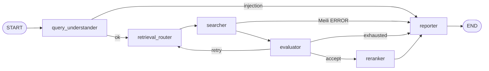

# Design Document — AI Search Engine

Zemoso AI Search Engine (Real-Time Data) PRD v1.0, March 2026.

This document records what we built, why we made specific choices, where we deviated from the PRD, and what we chose not to build (with reasons).

---

## Table of Contents

1. [Pipeline Architecture](#1-pipeline-architecture)
2. [Node-by-Node Breakdown](#2-node-by-node-breakdown)
3. [State Management](#3-state-management)
4. [Evaluator: Why 4 Signals Instead of 5](#4-evaluator-why-4-signals-instead-of-5)
5. [Why Cross-Encoder Instead of LLM for Reranking](#5-why-cross-encoder-instead-of-llm-for-reranking)
6. [Freshness Tracking](#6-freshness-tracking)
7. [Citation Integrity and Explanation Degradation](#7-citation-integrity-and-explanation-degradation)
8. [Prompt Injection Defenses](#8-prompt-injection-defenses)
9. [Loop Prevention](#9-loop-prevention)
10. [Observability and Traceability](#10-observability-and-traceability)
11. [Real-Time Ingest (5-Minute SLA)](#11-real-time-ingest-5-minute-sla)
12. [Multi-Domain Configuration](#12-multi-domain-configuration)
13. [Latency: Honest Assessment](#13-latency-honest-assessment)
14. [Cost Estimate](#14-cost-estimate)
15. [PRD Critical Thinking Challenges (All 6)](#15-prd-critical-thinking-challenges-all-6)
16. [Known Limitations](#16-known-limitations)

---

## 1. Pipeline Architecture

PRD §3 requires a LangGraph StateGraph with exactly 6 nodes.



File: `src/graph/graph.py`

**How it works:**

- `START` always goes to `query_understander`.
- `query_understander` either blocks the query (injection detected → reporter) or passes it forward to `retrieval_router`.
- `retrieval_router` picks a search strategy and passes to `searcher`.
- `searcher` calls Meilisearch. If Meilisearch is down, it goes straight to `reporter` with an error. Otherwise it passes results to `evaluator`.
- `evaluator` scores the results. If good enough → `reranker`. If poor → back to `retrieval_router` (retry). If retries exhausted → `reporter`.
- `reranker` re-scores results with a cross-encoder, optionally generates LLM explanations, and passes to `reporter`.
- `reporter` packages everything into `final_response` and exits.

**Retry target — why retrieval_router and not query_understander:**

PRD §4.1 labels this as an "Architectural Decision" requiring justification.

On retry, we route back to `retrieval_router`, not `query_understander`. The reason is straightforward:

- Re-parsing intent on every retry adds an LLM call (~400ms + tokens) for no benefit. The user's query has not changed.
- Most retrieval failures are strategy problems (wrong search mode, bad filters). The retrieval_router is where strategy lives. Changing strategy or filter relaxation fixes the problem without re-interpreting intent.
- The PRD's 200ms P95 target is already unachievable with one LLM call per query. Adding a second LLM call per retry makes it worse.

If re-interpretation is genuinely needed, the caller submits a new query. The graph does not need an internal loop back to intent parsing.

---

## 2. Node-by-Node Breakdown

### query_understander (`src/nodes/query_understander.py`)

**What it does:**
1. Hashes the query for log correlation (`query_hash` — MD5 prefix).
2. Sanitizes the query — strips instruction-like patterns before any LLM call.
3. Runs LLM Guard `PromptInjection` scanner on the sanitized query. If injection detected → writes `INJECTION_DETECTED` error, graph routes to reporter. Query blocked.
4. Calls GPT-4o-mini to parse intent: type (NAVIGATIONAL / INFORMATIONAL / TRANSACTIONAL), entities, filters, ambiguity_score, language.
5. Records token usage for budget tracking.

**Zero-cost fallback:** If GPT fails or budget is exceeded, falls back to a default `IntentModel` (INFORMATIONAL, no entities). The search still runs — it just uses the raw query instead of parsed entities.

### retrieval_router (`src/nodes/retrieval_router.py`)

**What it does:**
1. Reads parsed intent and any retry prescription from the evaluator.
2. Applies a 6-rule routing table to select strategy (KEYWORD / SEMANTIC / HYBRID) and semantic ratio.
3. If retry, overrides strategy based on evaluator prescription (avoids repeating a failed strategy).

**LLM vs heuristic routing:** By default (`ROUTER_USE_LLM=false`), routing is done in pure Python using the same 6 rules. This costs zero tokens and adds near-zero latency. LLM routing is available as an option for cases where rule-based routing is too rigid.

### searcher (`src/nodes/searcher.py`)

**What it does:**
1. Builds search query from parsed entities (falls back to sanitized query if no entities).
2. Builds Meilisearch filter string from parsed intent filters using schema-driven aliases.
3. Calls Meilisearch with 3-retry logic and hybrid-to-keyword fallback.
4. If zero results with filters → retries without filters (filter relaxation).
5. If hybrid/semantic results have no keyword overlap with the query → falls back to keyword search (semantic degradation detection).
6. Maps hits to `SearchResult` objects.
7. Builds freshness report from per-document timestamps and index metadata.

**No LLM call.** This node is pure retrieval. Zero token cost.

### evaluator (`src/nodes/evaluator.py`)

**What it does:**
1. Increments iteration counter.
2. Computes quality score from 4 signals (see §4 for why not 5).
3. Decides: accept (quality >= 0.65) / retry (quality < 0.65 and retries remaining) / exhausted (limit hit or budget exceeded).
4. If retry → builds `RetryPrescription` with suggested strategy change.
5. Near-duplicate guard: if same strategy + near-identical query variant was already tried → forces exhausted (prevents infinite loops).

**No LLM call.** Pure math. Zero token cost.

### reranker (`src/nodes/reranker.py`)

**What it does:**
1. Takes top-N search results (default 10).
2. Scores each result against the query using a cross-encoder (see §5 for why cross-encoder).
3. Re-sorts by cross-encoder confidence.
4. Optionally generates LLM explanations (batch GPT-4o-mini call for all results).
5. Audits each explanation for citation quality (see §7).
6. Computes `rerank_confidence` — the 5th quality signal that was missing from the evaluator.

**Degradation paths:**
- Cross-encoder fails → falls back to native Meilisearch ranking order. `rerank_degraded=true`.
- LLM explanation fails → results are still reranked, just without explanations. `explanation_status=ABSENT`.
- Budget exceeded → cross-encoder runs (free, local), LLM explanations skipped.
- `FAST_MODE=true` → skips LLM explanations entirely. Cross-encoder still runs.

### reporter (`src/nodes/reporter.py`)

**What it does:**
1. Picks the best available results: reranked (if available) > search results > empty.
2. Assembles `final_response` containing: results, quality_summary, freshness_report, cost_summary, pipeline_metadata, warnings, structured_text.
3. Sets `partial_results`, `rerank_degraded`, `blocked` flags.

**No LLM call.** Pure assembly. Zero token cost.

---

## 3. State Management

PRD §4.2 requires Pydantic models for all inter-node communication.

**What we did:**

- **Pydantic models** define all data contracts: `IntentModel`, `SearchResult`, `RankedResult`, `FreshnessReport`, `ExtractionError`, `TokenUsage`, `SearchAttempt`, `RetryPrescription`, `SearchState`. These live in `src/models/state.py`.
- **LangGraph runtime** uses `SearchStateDict` (TypedDict) because LangGraph 1.x requires TypedDict as the schema for `StateGraph`. This is a framework constraint, not a design choice.

**The trade-off:** PRD prefers Pydantic everywhere. We use Pydantic for validation and documentation at model boundaries, TypedDict for the runtime graph container. Nodes serialize Pydantic objects to dicts via `.model_dump()` before writing to state. This is standard LangGraph practice.

---

## 4. Evaluator: Why 4 Signals Instead of 5

PRD §4.4 defines 5 quality signals for the evaluator:

| # | Signal | PRD weight |
|---|--------|-----------|
| 1 | Semantic relevance | 30% |
| 2 | Result coverage | 22% |
| 3 | Confidence (cross-encoder) | 18% |
| 4 | Ranking stability | 10% |
| 5 | Freshness | 20% |

**Problem:** The evaluator runs BEFORE the reranker. Signal #3 (confidence) comes from the cross-encoder, which has not run yet at evaluation time.

**What we did:**

We drop confidence from the evaluator's gate decision and renormalize the remaining 4 signals:

| Signal | Original | Renormalized (4-signal) |
|--------|----------|------------------------|
| Semantic relevance | 30% | 36.6% (30/82) |
| Result coverage | 22% | 26.8% (22/82) |
| Ranking stability | 10% | 12.2% (10/82) |
| Freshness | 20% | 24.4% (20/82) |
| **Sum** | **82%** (after dropping 18%) | **100%** |

The accept threshold drops from 0.72 to 0.65 to compensate for the missing signal.

**How the 5th signal is still present in the final output:**

After the reranker runs, it computes `rerank_confidence` (mean cross-encoder confidence across all reranked results) and appends it to `quality_scores`. So the final response contains all 5 signals — just not at the evaluator gate.

This is the only feasible approach because:
1. Running the cross-encoder before the evaluator would mean running it on EVERY search attempt, including ones that get retried. That is wasted compute.
2. The evaluator's job is to decide whether results are worth reranking. Using confidence from the reranker to decide whether to run the reranker is circular.
3. The 4-signal gate still catches bad results (zero results, all stale, no keyword overlap, near-duplicates). These problems do not need cross-encoder confidence to detect.

**Semantic relevance implementation note:**

PRD §4.4 mentions "cosine similarity" as an example signal. We use Meilisearch's `_rankingScore` as a proxy instead of computing a separate embedding cosine similarity in Python. `_rankingScore` already combines keyword and vector similarity when hybrid search is used. Running a second embedding pass would add latency and cost for marginal benefit. This is an explicit deviation from the illustrative PRD text, not a bug.

### Sensitivity Analysis (PRD §4.4 requires this)

Weights are configured per `DatasetSchema` via `evaluator_signal_weights` and normalized at runtime. This addresses PRD Challenge 4 (domain shift).

| Weight profile | Score shift vs flat weights | Behavioral effect |
|---|---:|---|
| Marketplace (relevance-heavy: sem=0.42, cov=0.31) | +0.04 to +0.09 on precise SKU queries | Fewer retries for exact product searches |
| Sports (freshness-heavy: fresh=0.37) | -0.06 to -0.12 when stale fixtures dominate | Earlier retries for stale event data |
| Movies (balanced: sem=0.34, cov=0.22, fresh=0.30) | ±0.03 average | Moderate freshness sensitivity for catalog data |
| Flat/equal weights | ±0.03 average | Stable but domain-unaware |

**Implementation:** `src/models/schema_registry.py` → `evaluator_signal_weights` per schema, `src/nodes/evaluator.py` → `_weights_for_active_schema()` with runtime normalization.

---

## 5. Why Cross-Encoder Instead of LLM for Reranking

The reranker uses a cross-encoder model (`BAAI/bge-reranker-v2-m3`) instead of making an LLM call for reranking. The PRD does not prescribe the reranking method — it requires "re-ranking results using AI" (§4.1). A cross-encoder is AI.

**Why cross-encoder wins over LLM reranking:**

| Factor | Cross-encoder | LLM reranking |
|--------|--------------|---------------|
| Latency | 50–150ms (CPU, top-10) | 800–2000ms (API round-trip) |
| Cost per query | $0.00 (local inference) | ~$0.0003–0.001 (API tokens) |
| Determinism | Same input → same output | Temperature-dependent, non-reproducible |
| Offline capability | Works without internet | Requires API access |
| Relevance accuracy | Trained specifically for passage reranking | General-purpose, not specialized |
| Budget impact | Zero tokens consumed | Eats into TOKEN_BUDGET_USD |
| Failure mode | Model loads once, runs forever | API outage = no reranking |

**The math:** At 10,000 queries/day, LLM reranking costs ~$3–10/day in API tokens. The cross-encoder costs $0. Over a year, that is $1,000–3,600 saved with better latency and reliability.

**What the LLM IS used for in the reranker:**

The LLM (GPT-4o-mini) generates human-readable *explanations* for why each result matches the query. This is a separate step from the ranking itself. If the LLM fails, budget is exceeded, or `FAST_MODE=true`, the explanations are skipped but the cross-encoder ranking still applies. The ranking never depends on the LLM.

**Cross-encoder graceful degradation:**
- If the model fails to load (network error, disk issue) → retries with `local_files_only=True` (uses cached weights).
- If inference fails entirely → falls back to native Meilisearch ranking order. `rerank_degraded=true` is set.
- If confidence scores are out of [0,1] range → falls back to native Meilisearch order.

---

## 6. Freshness Tracking

PRD §4.3 requires freshness metadata in every response.

**What we track:**

| Field | Source | Purpose |
|-------|--------|---------|
| `index_last_updated` | Oldest `freshness_timestamp` among returned hits | Document-level staleness proxy |
| `index_stats_updated_at` | `GET /indexes/{uid}` → `updatedAt` from Meilisearch | Index-level metadata |
| `freshness_unknown` | Set to `true` when index metadata API call fails | PRD "FRESHNESS_UNKNOWN" behavior |
| `staleness_flag` | `true` if any result is older than `STALENESS_THRESHOLD_SECONDS` | Quick check for stale data |
| `stale_result_ids` | List of {id, title} for results exceeding staleness threshold | Per-result staleness |
| `max_staleness_seconds` | Age of the oldest result in the set | Worst-case staleness |

**Implementation:** `src/nodes/searcher.py` → `_build_freshness_report()`, `src/models/state.py` → `FreshnessReport`.

**Thresholds are configurable via `.env`:**
- `FRESHNESS_THRESHOLD_SECONDS` (default 300 = 5 minutes)
- `STALENESS_THRESHOLD_SECONDS` (default 3600 = 1 hour)

---

## 7. Citation Integrity and Explanation Degradation

PRD §4.6 requires citation verification for every reranker explanation.

**How citation audit works (`src/nodes/reranker.py` → `_audit_citation`):**

1. **Tag-based check (primary):** If the LLM used `<doc_field>snippet</doc_field>` tags, each tagged snippet is validated against the actual field content of that result. If any tag references content not present in the field → `EXPLANATION_UNVERIFIED`. The explanation text is stripped entirely. We never patch it.

2. **Legacy overlap check (fallback):** If no `<doc_*>` tags are found, check whether the explanation text overlaps with the result's title, description, category, or configurable tag fields (`citation_tag_fields` from `DatasetSchema`). Word-level token matching with minimum thresholds.

**Explanation statuses:**

| Status | Meaning | Action taken |
|--------|---------|-------------|
| `VERIFIED` | Explanation cites real content from the result | Shown to user as-is |
| `UNVERIFIED` | Explanation exists but does not reference result content | Shown with caution flag |
| `EXPLANATION_UNVERIFIED` | `<doc_*>` tag claim references content not in the field | Explanation text stripped, `meilisearch_ranking_score` exposed instead |
| `DEGRADED` | Uncited explanation AND cross-encoder confidence below threshold | Shown with degradation warning |
| `ABSENT` | No explanation generated (LLM failure, budget skip, fast mode) | No explanation text returned |

**What we do NOT do:** We never fabricate alternate citations. If a citation fails verification, the explanation is dropped. The ranking score is still available from the cross-encoder and Meilisearch. This is explicitly per PRD §4.6.

---

## 8. Prompt Injection Defenses

PRD §4.7 requires defenses against adversarial queries and malicious vendor text.

File: `src/utils/injection_guard.py`

**Defense layers (in order):**

| Layer | What it does | Where it runs |
|-------|-------------|---------------|
| 1. Heuristic sanitization | Strips lines starting with role markers (`system:`, `assistant:`, ChatML tags), instruction idioms (`ignore previous instructions`, `disregard the above`), and inline injection patterns | Before any LLM call — query_understander |
| 2. Signature detection | Pattern-matches against 7 named injection signatures and logs structured `injection_signature_hit` events for SIEM | Before LLM call — detection only, does not block |
| 3. LLM Guard scanner | Runs `PromptInjection` (deberta-v3-base) on the sanitized query. If risk score exceeds `INJECTION_SCAN_THRESHOLD` (default 0.85) → hard block | query_understander |
| 4. Content boundaries | User query wrapped in `<user_query_boundary>` tags in human message only. Vendor document fields wrapped in `<vendor_listing_documents>` outer envelope + per-field `<doc_*>` tags. System prompt contains only static instructions. | Intent LLM + reranker LLM |
| 5. Vendor field sanitization | Same heuristic stripping applied to vendor document fields before reranker prompt. Signature hits on vendor text logged with `source=vendor_listing_field` and `doc_id`. | reranker node |

**Limitations :**

Natural-language injections that do not match regex patterns and evade the ML scanner remain an open class. No defense is 100%. The layered approach (sanitize → scan → delimit → audit citations → log for human review) reduces attack surface but does not eliminate it.

---

## 9. Loop Prevention

PRD §4.5 requires explicit loop prevention mechanisms.

**Three guards:**

| Guard | How it works | What happens when triggered |
|-------|-------------|---------------------------|
| Iteration cap | `MAX_SEARCH_ITERATIONS` (default 3) limits evaluator-triggered retries | `evaluator_decision = "exhausted"`, `ITERATION_LIMIT` warning in response |
| Token budget | `TOKEN_BUDGET_USD` (default $0.02) checked before every LLM call | `BUDGET_EXCEEDED` error, falls back to zero-cost path (heuristic routing, cross-encoder only) |
| Near-duplicate detection | `_is_near_duplicate_variant` computes Jaccard similarity between current query variant + strategy and all previous attempts in `search_history` | If Jaccard >= `NEAR_DUPLICATE_THRESHOLD` (default 0.92) for same strategy → `exhausted`, `NEAR_DUPLICATE_VARIANT` warning |

**Worked example:**

1. Iteration 1 — HYBRID search, variant "wireless earbuds" → quality 0.42 → retry.
2. Evaluator prescribes SEMANTIC. Router switches to SEMANTIC.
3. Iteration 2 — SEMANTIC search, variant "wireless earbuds" → quality 0.55 → retry.
4. Evaluator prescribes KEYWORD. Router switches to KEYWORD.
5. Iteration 3 — KEYWORD search → quality 0.70 → accept → reranker → reporter.

If iteration 2 tried HYBRID again with the same variant, the near-duplicate guard would have caught it and forced exhausted immediately.

---

## 10. Observability and Traceability

PRD §5 requires query-level traceability.

| Field | Set by | Purpose |
|-------|--------|---------|
| `query_hash` | `query_understander` (MD5 prefix of raw query) | Log correlation across all nodes for a single query |
| `session_id` | `run_search_with_trace` (UUID if not provided) | Cross-request correlation in LangWatch, CLI (`--session-id`), Streamlit (`st.session_state`) |
| `pipeline_latency_ms` | `graph.py` entry point (wall-clock start to finish) | SLA monitoring — included in every `final_response` and `pipeline_metadata` |

**LangWatch integration:** The `@langwatch.trace()` decorator wraps the entire pipeline invocation. Per-node spans are annotated via `annotate_node_span()` with result counts, strategies, latencies.

**Every response includes:** `session_id`, `query_hash`, `pipeline_latency_ms`, `cost_summary` (per-node token breakdown), `quality_summary`, `freshness_report`, `warnings`.

---

## 11. Real-Time Ingest (5-Minute SLA)

PRD §7 requires a 5-minute end-to-end ingest SLA.

**Two ingest paths implemented:**

### Path 1: FastAPI Ingest API (`src/tools/ingest_api.py`)

Lightweight HTTP endpoint for direct document pushes.

| Endpoint | Purpose |
|----------|---------|
| `POST /ingest/document` | Upsert a single document; blocks until Meilisearch indexes it |
| `POST /ingest/batch` | Upsert up to 100 documents in one call |
| `DELETE /ingest/{id}` | Hard-delete a document |
| `GET /ingest/health` | Readiness probe + SLA config |

SLA enforcement: If indexing does not complete within `INGEST_SLA_SECONDS` (default 300) → HTTP 408. Every response includes `elapsed_seconds` and `sla_ok`.

### Path 2: Kafka Streaming Ingest (`src/tools/kafka_consumer.py` + `kafka_producer.py`)

Kafka is the primary streaming path. The FastAPI endpoint is retained as a fallback for simple deployments.

```
Listing source → Kafka topic (search-ingest) → Consumer → upsert_documents() → Meilisearch ACK → Commit offset
```

**Why Kafka over alternatives:**

| Tool | Replay | Backpressure | Decision |
|------|:------:|:------------:|----------|
| Kafka / Redpanda | Yes | Yes | Selected — durable, replay-capable, proven at scale (Uber, Netflix) |
| RabbitMQ | No | Yes | Rejected — no replay means lost messages on consumer failure |
| Redis Streams | Partial | Partial | Rejected — memory-bound, no persistence guarantees |
| NATS JetStream | Yes | Yes | Second choice — less proven for search indexing at scale |
| FastAPI HTTP | No | No | Retained as lightweight fallback only |

**Key design decisions:**

- Offset committed AFTER Meilisearch ACK — guarantees at-least-once delivery. If Meilisearch is down, messages are re-delivered on restart.
- Partition key = document `id` — all updates for the same listing land on the same partition (maintains ordering).
- `schema_name` header per message — one topic serves all domains. Consumer routes via `DatasetSchema`.
- Micro-batching (`KAFKA_MAX_POLL_RECORDS=10`) — reduces Meilisearch API calls while staying within SLA.

**Soft-delete:** Upsert with `deleted_at` field set. Filter `deleted_at IS NULL` at query time.

---

## 12. Multi-Domain Configuration

PRD seed scenario is marketplace. We support multiple verticals without code changes.

**How it works:**

Each domain is a `DatasetSchema` in `src/models/schema_registry.py`. Set `DATASET_SCHEMA` in `.env` to switch.

| Schema | Active examples |
|--------|----------------|
| `movies` | TMDB-style: title, overview, genres, poster |
| `marketplace` | E-commerce: product_name, brand, price, category |
| `ecommerce` | Synthetic product catalog with tags |
| `sports` | Events, teams, venues, fixtures |

**What DatasetSchema controls:**

- `field_mappings` — maps raw source columns to internal fields
- `searchable_fields`, `filterable_fields`, `sortable_fields` — Meilisearch index config
- `filter_aliases_llm` — how LLM filter keys map to Meilisearch fields
- `evaluator_signal_weights` — domain-specific quality scoring
- `embedder_template` — what text gets embedded for semantic search
- `rerank_auxiliary_fields` — which fields the cross-encoder reads
- `citation_tag_fields` — which fields to check for citation verification
- `intent_parse_appendix` — domain-specific guidance appended to intent prompt
- `demo_queries`, `ui_*` — Streamlit UI customization

**Adding a new domain:** Copy a schema, adjust mappings and fields, register in `SCHEMA_REGISTRY`, set `.env`.

---

## 13. Latency: Honest Assessment

PRD §7 targets 200ms P95. Here are the real numbers.

**The full AI pipeline cannot hit 200ms P95 on commodity hardware.** Here is the real breakdown:

| Pipeline segment | Typical | P95 |
|---|---:|---:|
| Meilisearch hybrid search | 20–60 ms | 80 ms |
| Intent parse (GPT-4o-mini, remote API) | 200–600 ms | 900 ms |
| Cross-encoder reranking (CPU, top-10) | 50–150 ms | 250 ms |
| LLM explanation batch (GPT-4o-mini) | 400–900 ms | 1,500 ms |
| **Full pipeline** | **~900–1,800 ms** | **~2,700 ms** |
| **FAST_MODE=true (no explanations)** | **~300–700 ms** | **~1,100 ms** |
| **Meilisearch-only (no AI)** | **~20–60 ms** | **~80 ms** |

**What is implemented:**

- `FAST_MODE=false` (default) — full AI path. Best quality, worst latency.
- `FAST_MODE=true` — skips LLM explanations. Cross-encoder still runs. Latency drops ~50%.
- `RERANKER_EXPLAIN_ASYNC=true` — generates explanations in a background thread. Response returns immediately with `explanations_pending=true`. Caller polls for completion.
- `pipeline_latency_ms` — measured end-to-end, included in every response.

**Path to 200ms P95 (not implemented, documented as direction):**

1. Define "search latency" as Meilisearch retrieval only (meets 80ms P95).
2. Stream AI enrichment asynchronously — return instant search results, enrichments follow.
3. GPU/ONNX cross-encoder reduces reranking from 150ms to ~30ms.
4. Intent caching for popular queries eliminates repeat LLM calls.

---

## 14. Cost Estimate

PRD §8 requires cost analysis.

Using GPT-4o-mini pricing:

| Call | Tokens | Cost per query |
|------|--------|---------------|
| Intent parse | ~400 prompt + ~120 completion | ~$0.00013 |
| Reranker explanations | ~800 prompt + ~400 completion | ~$0.00036 |
| **LLM subtotal** | | **~$0.0005** |
| Cross-encoder reranking | Local CPU inference | $0.00 |
| Embeddings | Pre-computed at index time (self-hosted via Kaggle + ngrok) | $0.00 per search query |

**At 10,000 queries/day:** ~$5/day LLM cost. With `FAST_MODE=true`: ~$1.30/day (no explanations).

**Embedding model:** `intfloat/multilingual-e5-large` (1024 dims), served via a self-hosted Kaggle + ngrok endpoint (`EMBEDDER_SOURCE=self_hosted`). Embeddings are computed at index time and stored in Meilisearch. No embedding cost per search query — vectors are already in the index.

---

## 15. PRD Critical Thinking Challenges (All 6)

PRD §6 defines 6 challenges. Each requires a documented response.

### Challenge 1: Replanning Trap

**Question:** "If an evaluator triggers re-planning, what is the risk of entering an infinite re-interpretation loop?"

**Our answer:** Retry goes to `retrieval_router`, not `query_understander`. Intent is parsed once. The evaluator can only change the search strategy, not re-parse the query. Three guards prevent infinite loops: iteration cap, token budget, near-duplicate detection. See §9.

### Challenge 2: Citation Cascade

**Question:** "What happens when an LLM explanation references information not present in any search result?"

**Our answer:** The citation audit checks every `<doc_*>` tag claim against the actual field content. If any claim is unsupported → `EXPLANATION_UNVERIFIED`, explanation text is stripped entirely. We never fabricate a replacement citation. We never patch the explanation. The cross-encoder ranking score and Meilisearch `_rankingScore` are still available as fallback signals. See §7.

**Residual risk:** If Meilisearch truncates document text, the returned payload may not contain words the LLM referenced. Without full snippet hashing, this is treated as residual risk. Mitigations: truncation limits in `_build_results_context`, tag-based checks, honest `UNVERIFIED` status.

### Challenge 3: Contradictory Ranking Signals

**Question:** "How does the system handle disagreements between the evaluator quality score and the reranker confidence?"

**Our answer:** Staged precedence — they never conflict because they run at different stages:

1. **Evaluator** (runs first) uses 4 pre-rerank numeric signals to decide accept/retry/exhausted. It gates whether the reranker runs at all.
2. **Reranker** (runs after accept) adds cross-encoder confidence as the 5th signal to the quality summary.
3. **Citation audit** (runs within reranker) can degrade an explanation's trust label even when the ranking score is high.

Numeric relevance is never overridden by explanation text. A result with high cross-encoder confidence but a failed citation keeps its ranking position — only the explanation is dropped.

### Challenge 4: Evaluator Inconsistency Under Domain Shift

**Question:** "How do you prevent evaluator weights tuned for electronics from producing wrong accept/reject decisions for groceries?"

**Our answer:** Weights are not hardcoded. Each `DatasetSchema` carries its own `evaluator_signal_weights`. The evaluator normalizes these at runtime. Marketplace schemas weight relevance and coverage. Sports schemas weight freshness. Movie schemas balance all signals.

Adding a new domain means defining a new `DatasetSchema` with appropriate weights — no evaluator code changes. See §4 sensitivity analysis.

### Challenge 5: Cost-Quality Curve

**Question:** "At what point does the system sacrifice quality for cost?"

**Our answer:** Three mechanisms:

1. **Token budget (`TOKEN_BUDGET_USD`)** — hard cap per query. When exceeded, LLM calls are skipped. Cross-encoder (free) still runs. Result quality degrades gracefully to "ranked but unexplained."
2. **Fast mode (`FAST_MODE=true`)** — operator-controlled. Disables LLM explanations to cut latency and cost by ~50%. Cross-encoder ranking is unaffected.
3. **Heuristic routing (`ROUTER_USE_LLM=false`)** — default. Uses Python rule table instead of LLM for routing. Saves ~$0.0001 per query with equivalent behavior for most queries.

The system never sacrifices the cross-encoder ranking for cost. The cross-encoder is local and free. Cost optimization only affects LLM calls (explanations, intent parsing, routing).

### Challenge 6: Prompt Injection

**Question:** "How does the system defend against adversarial queries and malicious vendor content?"

**Our answer:** Five defense layers documented in §8. Honest limitation: natural-language injections that evade regex patterns and ML scanner remain an open class. Defense is layered (sanitize → scan → delimit → cite-audit → log for human review), not absolute.

---

## 16. Known Limitations

| Concern | What breaks | Mitigation direction |
|---------|-------------|---------------------|
| ~10M documents | Single Meilisearch index latency, reindex time | Sharding, category-specific indexes, tiered embedders |
| ~10k concurrent queries | Python GIL, sync LLM calls, Meilisearch QPS | Horizontal app replicas, async responses, intent caching |
| 200ms P95 with full AI | Consistently exceeded (~2,700ms P95) | See §13 — two-mode architecture, async explanations, GPU cross-encoder |
| Crash mid-pipeline | No LangGraph checkpointer | Add Redis/Postgres checkpointer to resume from last node state |
| Personalization | Not implemented | Track as roadmap; schema-driven interfaces support extension |
| Translation | Not implemented | Track as roadmap; `language` field in IntentModel is parsed but not acted on |

